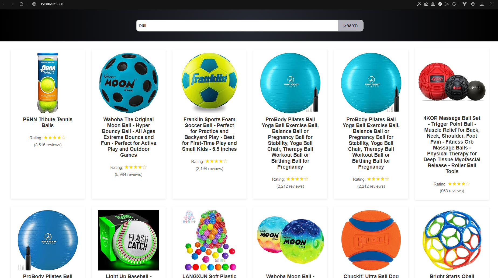

# Scraping project for Amazon search

Project using Node.js dependencies (express, axios and JSDOM), HTML, CSS and Vanilla JavaScript to create an endpoint / API / scrape to fetch the contents of the Amazon search results page for a given keyword.

## Prerequisites

Before you begin, ensure you have met the following requirements:
* You have installed the latest version of [Node.js](https://nodejs.org/)
* You have a Windows/Linux/Mac machine.

## Installation

To install the project, follow these steps:

1. **Clone the repository**

   ```bash
   git clone git@github.com:beatriznbt/carvalho-aleixo-internship.git
   cd carvalho-aleixo-internship

 2. **Install the dependenciesNavigate to the project directory and run:**

    ```bash
    npm install

  This will install all the necessary Node.js packages specified in package.json.

  ## Usage

  To run the project, follow these steps:

  1. **Start the serverIn the project directory, run:**

     ```bash
     npm start
 This command will start the server on http://localhost:3000. You can access the application by visiting this URL in your web browser.

 2. **Using the Application**

• Enter a search keyword in the input box and click the "Search" button to fetch product data.

• The results will be displayed on the page under the search bar.

 

### Contact

If you want to contact me you can reach me at beatriznbt@gmail.com.
